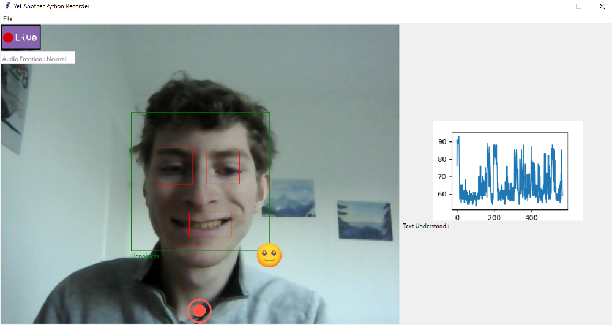

# Internship-Project-AI
The goal of the intership was to create a software that could read data from both the webcam and the microphone of a computer to feed it to an AI. The AI would then predict the emotions of the data (image & audio) and the software would show the results on screen. This process is done in real time using OpenCV and FFMPEG.

The end goal of the thesis is to use this software in classrooms. This would enable teacher to have precise insights on their students.

## Technologies Used
- Python
- OpenCV
- FFMPEG

## How to install requirements
2 options :
- Launch installRequirements.bat (if on windows)
- run "pip install -r requirements.txt" on a terminal

Due to size issue, the deberta model "deberta_95.h5" must be placed manually in "assets\models".

## How to launch the application
Run YAPR.py

## Screenshot

